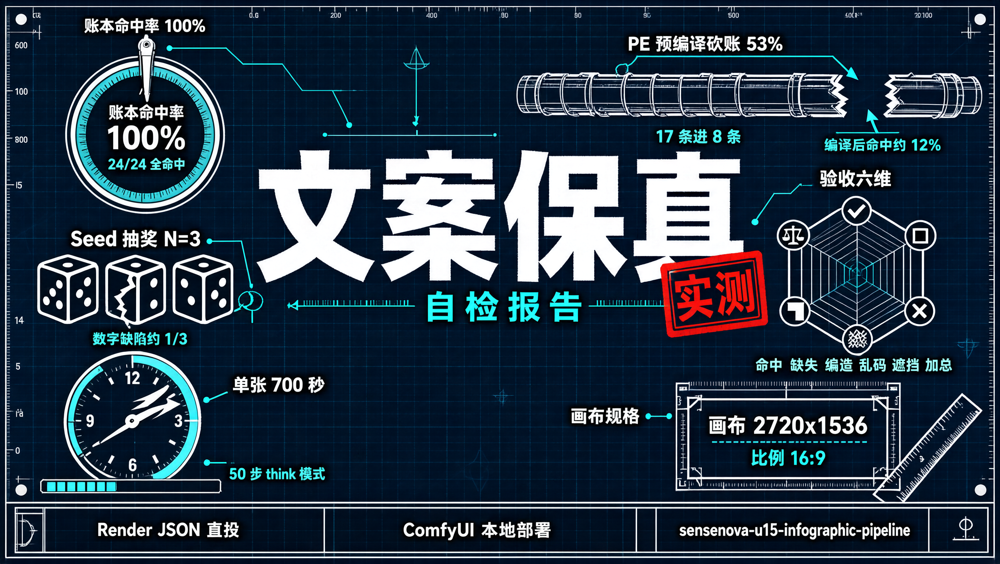

# SenseNova U1.5 信息图生产管线（ComfyUI 本地部署 · 文案保真 · VLM 自动验收）

> 单卡跑 SenseNova U1.5 Lite（8B-MoT），手工 Render JSON 直投出高密度中文数据信息图，
> 配套 VLM 逐字验收闭环。本文所有图均为**虚构演示数据**。



> 门面图即本管线给自己出的质检报告：图上「账本命中率 100%」「预编译砍账 53%」等全部数据，
> 均来自本仓库真实消融实验（见 [ablation/results.md](ablation/results.md)）。

## 效果一览

| 作品 | 风格 | 版式 | 分辨率 | 文字验收 |
|------|------|------|--------|----------|
| [自检报告（门面图）](examples/selftest_v1.png) | 工程蓝图 | 中央大字+四模块仪表 | 2720×1536 | 19/19 全命中 |
| [景德镇·陶瓷产业](examples/jingdezhen_infographic.png) | 青花瓷 | 中央大字+两列网格 | 2720×1536 | 24/24 全命中 |
| [敦煌·文旅横卷](examples/dunhuang_infographic_v2.png) | 壁画岩彩 | 横卷叙事 | 2880×1440 | 17/18（吞 0，另有少量鬼画符瑕疵） |
| [白板手绘风格迁移](examples/figecho_whiteboard_v2.png) | 手绘科普 | 单图 | — | 两轮迭代 8→9.5 分 |

消融实验见 [ablation/results.md](ablation/results.md)——同题三种 prompt 策略的文字保真对比。

## 核心方法：文案保真三件套

多模态生成模型画"风格化数据信息图"的最大痛点不是画面，而是**文字层**：数字幻觉、伪文字、
该画的字不画。本项目用三件套把中文文案命中率从 ~35% 拉到 100%：

1. **Render JSON 直投**（绕过 PE 编译）：模型按训练时格式理解 subjects / scene / composition /
   visible_copy / negative。实测 GLM 预编译会把 17 条文字砍到 8 条进账本，图上缺字变空壳——
   所以高密度文案场景一律手工账本直投（详见 [docs/render-json-guide.md](docs/render-json-guide.md)）
2. **visible_copy 穷举账本**：每一条要渲染的字（含标题/数据/落款）各一条 entry，
   绑定 text/category/placement/appearance，一条不落
3. **VLM 逐字验收**：生成后用视觉模型对照期望清单逐项核对（命中/缺失/编造/乱码/遮挡/加总逻辑），
  不过验收就换 seed 重 roll（见 `scripts/verify_with_vlm.py`）

## 快速开始

```bash
pip install -r scripts/requirements.txt

# 环境变量（ComfyUI 带 Basic Auth 时）
export COMFYUI_BASE="http://your-server:8009"
export COMFYUI_USER="user" COMFYUI_PASS="pass"

# 一键生成 + 自动验收
bash run_demo.sh          # 默认跑景德镇示例
# 或
python scripts/generate.py workflows/examples/dunhuang_v2.json -o out.png --verify
```

前置条件（模型/节点安装）见 [docs/deployment.md](docs/deployment.md)。

## 仓库结构

```
├── workflows/examples/      # 可直接投喂的 Render JSON（虚构数据）
├── scripts/
│   ├── generate.py          # 提交 ComfyUI → 轮询 → 下载
│   └── verify_with_vlm.py   # VLM 逐字验收（OpenAI 兼容接口）
├── examples/                # 效果图 + 消融废稿
├── ablation/results.md      # 文案保真消融数据
└── docs/                    # 部署指南 / Render JSON 规范 / 踩坑 FAQ
```

## 已知坑（FAQ 摘要，详见 docs/faq.md）

- PE 预编译砍文案（17→8 条账本）→ 高密度场景手工账本直投
- 数字保真是 seed 抽奖 → 验收不过换 seed，或（虚构数据）让账本跟图走
- ComfyUI-SenseNova-U1 v0.2.0 的 ImageEdit 节点 AttributeError → 修图走重 roll
- flash_attn 在部分容器炸 → attn_backend 硬编码 sdpa

## License

MIT
